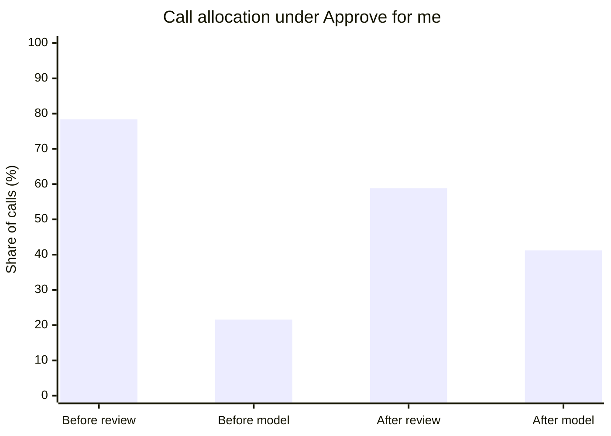

# Codex Control Plane Hooks

> Spend expensive model inference on the work itself. Keep repeated approvals, mechanical auto-review, and retry churn small.

Codex Control Plane Hooks is a versioned, local guardrail plugin for Codex. It adds event-scoped command checks, one-shot approval transactions, secret and sensitive-data controls, Agent lifecycle tracking, and evidence-backed completion checks.

The project optimizes **where execution budget goes**. It does not try to minimize total Token use. A good outcome can use more Tokens overall while directing a larger share to substantive reasoning, implementation, testing, and independent review.

> [!WARNING]
> This plugin is an additional guardrail. It does not replace Codex sandboxing, approval policy, repository permissions, backups, or human review. Pattern checks can produce false positives and false negatives.

## Why this exists

A control plane can help Codex spend less workflow capacity on:

- repeated approval prompts for the same bounded transaction;
- auto-review loops around already authorized commands;
- generic instructions injected into every turn;
- retries caused by stale or mismatched authorization state;
- unfinished Agent state that survives compaction or completion claims.

The recovered capacity can support deeper implementation, tests, independent review, and model reasoning.

## What success looks like

Total Token reduction is not the primary metric. Useful measurements include:

| Metric | Desired direction |
|---|---|
| Review tax: auto-review calls divided by substantive model calls | Down |
| Repeated approval prompts after one valid scoped grant | Toward zero |
| Valid workflows blocked by stale or mismatched state | Toward zero |
| Substantive reasoning calls as a share of all calls | Up |
| Verified deliverables completed per unit of workflow overhead | Up |
| Safety-critical denials and sensitive-data containment | Preserved |

Measure these on comparable tasks, model settings, and host versions. Call counts alone do not reveal Token allocation by model, and a heavier task mix can increase total Token use while still improving allocation quality.


## Observed effect under `Approve for me`

The following public sample uses one maintainer's official Codex Analytics data from 2026-07-09 through 2026-07-22. The comparison boundary is the thin-hook rollout on 2026-07-14.



| Metric | Before: 2026-07-09 to 2026-07-13 | After: 2026-07-14 to 2026-07-22 | Change |
|---|---:|---:|---:|
| Total Tokens per day | 0.834B | 1.043B | +25.1% |
| Total calls per day | 1,534.8 | 861.9 | -43.8% |
| `codex-auto-review` calls per day | 1,204.0 | 507.0 | -57.9% |
| Substantive model calls per day | 330.8 | 354.9 | +7.3% |
| GPT-5.6 Sol/Luna/Terra calls per day | 197.6 | 301.3 | +52.5% |
| `codex-auto-review` share of calls | 78.4% | 58.8% | -19.6 percentage points |
| Auto-review calls per GPT-5.6 call | 6.09 | 1.68 | -72.4% |

The dashboard exposes total Token usage and call counts by model. It does not expose per-model Token totals. The chart therefore measures call allocation as a proxy. Higher total Token use, fewer review calls, and more GPT-5.6 calls are strongly consistent with budget moving from workflow review into substantive inference, while the exact Token transfer remains unquantified.

This sample is observational. Task mix and private Hook versions changed during the period, and the current public `v0.2.6` release was not held constant throughout the window.

### Approval-mode boundary

This allocation benefit primarily applies to the Codex app's **Approve for me** path, where ordinary command execution can invoke `codex-auto-review`.

| Access mode | Expected Hook value |
|---|---|
| **Approve for me** | Reduces duplicate approval review, repeated authorization, and retry loops; this is where review-budget reallocation can be material. |
| **Full access** | Ordinary commands already bypass most host approval review, so little review budget remains to reclaim. Command safety, secret controls, sensitive-data boundaries, scoped publication state, and Agent closure still apply. |

Do not select a broader access mode solely to reduce review usage. Choose the sandbox and approval mode for the required security boundary; use the Hook to reduce avoidable overhead inside that boundary.

## Design goals

- **Near-zero steady-state prompt tax.** Ordinary prompts and successful tool output do not receive generic policy lectures.
- **One approval for one bounded transaction.** Exact repository, working directory, command, branch, destination, and one-shot state travel together.
- **Local-first enforcement.** The Hook runtime performs dependency-free local checks and does not make background network requests.
- **Event-specific context.** Extra context appears only when a matching risk or lifecycle event needs it.
- **Runtime-owned Agent capacity.** The plugin tracks lifecycle state and does not impose an Agent-count ceiling.
- **Cross-platform behavior.** macOS, Ubuntu, and Windows paths have dedicated launch and host-smoke coverage.
- **Fail-closed high-risk paths.** Ambiguous, stale, replayed, drifted, or broader-than-authorized operations are rejected.

## What it covers

### Command and publication safety

- Selected destructive, mutating, dynamic-eval, package-install, network, and privilege-escalation patterns.
- Exact, one-shot Git/GitHub transaction state across turn, tool, working directory, command hash, repository scope, branch, and destination.
- Bounded continuation for unfinished publication transactions.
- Immutable push tickets bound to the resolved source commit and canonical remote identity.
- A constrained GitHub HTTPS clone lane with post-clone provenance tracking.

### Secrets and sensitive data

- Selected credential-like strings in prompts, tool input, and tool output.
- Optional organization markers, data terms, and durable destinations from a private `policy.json`.
- One-shot sensitive-disclosure grants bound to concrete configured terms and one canonical trusted destination.
- Clean redaction patches for supported local edit tools.

### Agents and completion

- Observed Agent lifecycle state and advisory nesting context.
- Pre-compaction state checkpoints.
- Stop blocking while Agents remain active.
- A small `verified-work-closure` Skill for evidence-backed completion receipts.

## Safe defaults

All experimental grants start disabled:

- natural-language command approvals;
- scoped Git/GitHub transaction grants;
- constrained GitHub HTTPS clone;
- sensitive-disclosure approvals.

The public package contains no organization marker, private data term, credential, personal path, Memory, trust state, or private workflow inventory. The example Rules file contains no active allow rule.

## Install

Review the repository and compatibility table before installation.

```bash
codex plugin marketplace add le-soleil-se-couche/codex-control-plane-hooks --ref v0.2.6
codex plugin add codex-control-plane-hooks@codex-control-plane-hooks
codex plugin list --marketplace codex-control-plane-hooks
```

Codex may require explicit Hook trust after installation. Review [`hooks.json`](plugins/codex-control-plane-hooks/hooks/hooks.json) and the invoked Python script before accepting trust in the Codex app.

Use the version tag for reproducible installation. Review builds may select an explicit commit SHA.

```bash
codex plugin marketplace upgrade codex-control-plane-hooks
```

`v0.2.6` binds each approved push destination and source commit into a one-time ticket, runs the network child from an isolated bare repository, hardens reservation identity, and applies one shared deadline to Windows Python discovery and process-tree cleanup.

### 准备 Windows 专用运行时

Windows 启动器只读取 `PLUGIN_DATA/runtime.json`，不会再从 `PATH`、`py.exe` 或 `python.exe` 猜测解释器。首次使用前必须运行一次 Python 3.12 运行时准备脚本。脚本不会下载 Python，也不会安装第三方包；请传入现有 Python 3.12 解释器的绝对路径：

```powershell
.\scripts\setup_runtime.ps1 `
  -PythonPath "C:\absolute\path\to\python.exe"
```

仓库根目录的脚本是受版本控制的开发入口，只负责转发参数；插件发布目录中的同名脚本仍是唯一实现和安装后入口。

脚本优先使用宿主提供的 `PLUGIN_DATA`，也可以在 `%USERPROFILE%\.codex\plugins\data` 下发现唯一匹配目录。发现结果不唯一时，请显式传入绝对 `-PluginDataPath` 或 `-CodexHome`；脚本不会猜测。

专用 venv 位于 `%USERPROFILE%\.codex\runtimes\codex-control-plane-hooks\versions`，并通过原子写入插件数据目录的 `runtime.json` 进行选择。重复执行会复用健康运行时。默认不删除旧版本；显式使用 `-PruneOldRuntime` 时至少保留两个版本，并跳过当前、正在使用、包含 reparse point 或无法安全检查的目录。

该 venv 仍依赖创建它的 Python 3.12 安装：它是隔离环境，但不是自包含 Python 发行版。清单缺失时启动器返回 `127`；清单或固定路径无效、解释器无法启动、版本不是 Python 3.12 时返回 `126`。Hook 自身的退出码和标准流保持不变。

## Configure

The plugin reads `policy.json` from the host-provided `PLUGIN_DATA` directory.

On macOS and Linux, an absolute `CONTROL_PLANE_POLICY` may select a current-user-owned regular file only when group and other permissions are absent, such as mode `0600`. Windows keeps policy inside `PLUGIN_DATA` so it inherits the host-managed directory boundary.

Start from [`examples/policy.example.json`](examples/policy.example.json). Keep real markers and terms in private plugin data and out of Git.

```json
{
  "sensitive_markers": ["Example Organization"],
  "sensitive_terms": ["account", "client", "position"],
  "durable_destination_markers": [],
  "enable_natural_language_approvals": false,
  "enable_scoped_git_transactions": false,
  "enable_constrained_github_clone": false,
  "enable_sensitive_disclosure_approvals": false
}
```

The files under `examples/` are minimal references. Installation does not copy them into `~/.codex`, and they should never replace a live configuration wholesale.

Detailed contracts:

- [Configuration](docs/configuration.md)
- [Hook contract](docs/hook-contract.md)
- [Threat model](docs/threat-model.md)

## Event model

| Event | Default behavior |
|---|---|
| `UserPromptSubmit` | Silent for ordinary prompts; activates configured sensitive-context handling when needed. |
| `PreToolUse` | Classifies the exact tool call and blocks or reserves matching high-risk operations. |
| `PermissionRequest` | Revalidates the exact pending grant and runner binding. |
| `PostToolUse` | Consumes matched one-shot state and checks bounded output for configured risks. |
| `SubagentStart` | Records lifecycle state and emits only relevant nesting guidance. |
| `PreCompact` | Saves a handoff checkpoint when active Agents exist. |
| `Stop` | Blocks only while tracked Agents remain active. |

## Verify locally

macOS or Linux:

```bash
python3 -B -m unittest discover -s tests -v
python3 scripts/smoke_hook_manifest.py
python3 scripts/check_release.py
python3 ~/.codex/skills/.system/plugin-creator/scripts/validate_plugin.py \
  plugins/codex-control-plane-hooks
```

Windows PowerShell:

```powershell
python -B -m unittest discover -s tests -v
python scripts/smoke_hook_manifest.py --windows-shell pwsh
python scripts/smoke_hook_manifest.py --windows-shell powershell
python scripts/check_release.py
```

For a private release-boundary check on macOS or Linux, create a UTF-8 file outside the repository with one literal marker per line, set mode `0600`, and pass it explicitly:

```bash
python3 scripts/check_release.py \
  --private-patterns-file /absolute/path/outside/repository/private-patterns
```

The checker scans bounded release files, source, filenames, and compound-suffix examples without echoing private markers. Binary files are rejected. GitHub Actions runs Gitleaks against complete reachable history.

## Compatibility

| Codex / surface | OS / arch | Python | Protocol and packaged-command gate | Codex live install smoke | Date |
|---|---|---|---|---|---|
| 0.145.0-alpha.18 bundled desktop CLI | macOS arm64 | 3.9.6 | 218 local tests plus manifest, release, and plugin checks | clean-profile install, Hook discovery/trust, safe allow, dangerous deny, and cross-turn publication resume | 2026-07-21 |
| 0.144.5 bundled desktop CLI | macOS arm64 | 3.9.6 | 205 local tests plus manifest, release, and plugin checks | clean-profile install, Hook discovery/trust, safe allow, and dangerous deny | 2026-07-17 |
| GitHub Actions with `@openai/codex@0.144.4` | Ubuntu 24.04 x64 | 3.9 / 3.12 | required on every push and PR | pinned clean-profile host smoke required by CI | 2026-07-17 |
| GitHub Actions with `@openai/codex@0.144.4` | Windows Server 2022 x64 | 3.9 / 3.12 | 两个 Python 版本均运行协议测试；仅 3.12 运行 `pwsh` 与 `powershell.exe` 打包门禁 | pinned clean-profile host smoke required by CI | 2026-07-28 |
| Dedicated Windows runtime setup | Windows Server 2022 x64 | 3.12 | PowerShell 5.1/7 固定运行时 setup、严格清单与 Hook 协议 | Windows Host smoke 由 CI 验证 | 2026-07-28 |
| 手工 Windows 10 门禁 | Windows 10 IoT Enterprise LTSC `10.0.19044` | 3.12 | PowerShell 5.1 与 PowerShell 7.6.4 打包 Hook 均通过 | Codex CLI 0.145.0 隔离 Host discovery、trust 写入/重读与运行时通过；Desktop UI 特有缓存行为尚未单独验证 | 2026-07-28 |

Runtime support and Codex-host compatibility are separate claims. Hook event names, matchers, output schemas, environment variables, and trust behavior can change between Codex versions.

## Known limits

- Checks run only for events matched by the manifest and emitted by the host.
- Hook launch, timeout, and fail-open behavior remain host-owned.
- Secret detection covers selected patterns and bounded text.
- Post-tool checks occur after a tool has produced output.
- Natural-language approvals, scoped Git/GitHub transactions, and constrained clone remain experimental and opt-in.
- Ambiguous scope, target, remote identity, replay, drift, force, history rewrite, bulk ref, local transport, custom receive-pack, or unsafe helper forms fail closed.
- Browser, Computer Use, and connector coverage depends on tool names and Hook events exposed by the host.
- The project does not defend a compromised OS account, Python runtime, Codex binary, plugin cache, or writable policy file.
- Native Windows relies on host-managed NTFS permissions. The Hook rejects observed symlinks and reparse points but does not independently audit every DACL ACE.
- Desktop GUI trust prompts remain outside hosted-runner CI coverage.

Read the [Hook contract](docs/hook-contract.md) and [Threat model](docs/threat-model.md) before enabling experimental grants.

## Publishing sanitized configurations

Publish minimal examples instead of a mechanically redacted personal `config.toml`, `AGENTS.md`, Rules file, Memory, or plugin inventory. Full configurations carry path, identity, trust-state, feature-flag, and private-workflow residue that is easy to miss and quick to become stale.

Keep live policy and optional private-marker files outside the repository.

## License

Apache-2.0. See [LICENSE](LICENSE).
